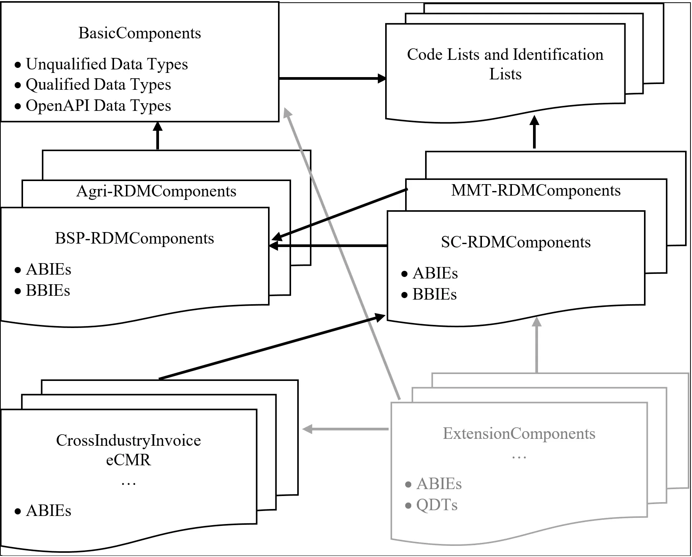

# UN/CEFACT JSON Schema draft 2020-12 meta-library publication

## Introduction

This directory contains JSON schema artefacts. They are fully based on the JSON schema draft 2020-12.
This means that they fully comply with the requirements of OpenAPI 3.1.x.  

The UN/CEFACT reference data models are provided in the library variant, with extended meta-information.  
This means that an individual meta-schema and an additional vocabulary is applied. The additional information
is included to support mapping-processes and the JSON-LD vocabulary creation. 

## Table of contents
<!-- TOC depthFrom:1 depthTo:3 withLinks:1 updateOnSave:1 orderedList:0 -->

- [Basic schema design rules](#basicPrinciples)
  - [Basic Components](#basicComponents)
    - [Primitive data types](#pdt)
	- [Unqualified data types](#udt)
    - [Qualified data types](#qdt)	
- [JSON filenames and sub-folder structure](#jsonFilenames)
- [What is this meta-library ?](#metaLibrary)

<!-- /TOC -->

## Basic schema design principles

<a name="basicPrinciples" />
Basic rules of the UN/CEFACT Core Component Library can be [found here.](https://unece.org/trade/uncefact/ccts) The version CCTS 2.01 is applied.
In the linked PDF document abbreviations like ABIE, BBIE etc. are explained in detail.

The following figure shows how the different CCTS classes are interlinked and can be extended.

### Basic Components

<a name="basicComponents" />The lowest level provides all basic data types used throughout the complete Core Component Library. The include four different types of data types:

#### Primitive data types (PDT)

<a name="pdt" />The PDT summarize the representations of those types that are the foundation for all other data types. 
They include
1. binaryType
to represent base64 encoded representation of binary information

2. booleanType
3. decimalType
This type is defined to restrict a string to a pattern representing decimal representations of numbers. 
The JSON built-in numeric data type is not suitable when exchanging numbers that need to be uses as calculation
basis e.g. for prices, amounts, taxes, wages including roundings with the needed precision. Using only the standard JSON
numeric datatypes for those scenarios will lead to issues especially with rounding and accurracy.
4. integerType
5. stringType

PDTs are normally not used directly in any Core Component libary object. Moreover, they [UDTs](#udt) are used instead that amend the PDTs.

#### Unqualified data types (UDT)

<a name="udt" />UDTs are the real basic data types used in the Core Component library. They combine the value itself 
with supplementary components (SCs), where needed to bring the value into the correct context.

1. amountType
This type is used to represent all kind of amounts. 
2. binaryObjectType
3. codeType
4. dateTimeType
5. dateType
6. graphicType
7. idType
8. indicatorType
9. measureType
10. numericType
11. percentType
12. pictureType
13. quantityType
14. rateType
15. soundType
16. textType
17. timeType
18. valueType
19. videoType

## JSON filenames and sub-folder structure

<a name="jsonFilenames" />

## What is this meta-library ?

<a name="metaLibrary" />
